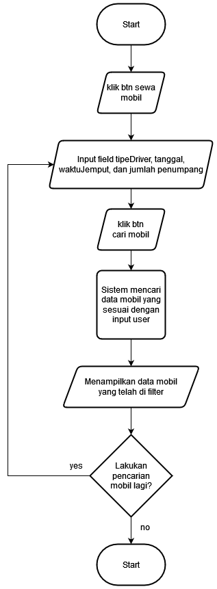

## Table of contents

- [Deskripsi](#deskripsi)
- [Algoritma](#algoritma)
- [Flowchart](#flowchart)

## Deskripsi

Pada project ini dibuat sebuah halaman dengan nama cars.html yang bertujuan untuk melakukan filter kepada data yang mobil-mobil yang ada sesuai dengan input dari user.

## Algoritma

Berikut adalah algoritma atau langkah penyelesaian yang digunakan:

1. Ketika tombol mulai sewa mobil pada halaman index.html diklik akan berpindah ke halaman cars.html
2. Pada halaman cars.html terdapat input field untuk user memasukkan data sesuai keinginannya
3. Ketika user klik tombol cari mobil sistem akan melakukan filter pada data cars 
4. Sistem akan menampilkan cars yang sesuai dengan inputan user 

## Flowchart

Berikut adalah flowchart atau bagan alur yang digunakan:

  

